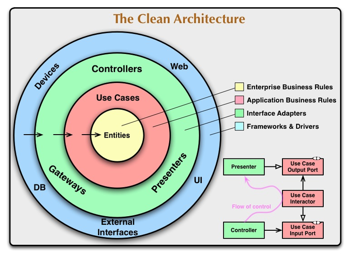

## 1. What is Clean Architecture?

Clean Architecture, proposed by Robert C. Martin (Uncle Bob), is a software design pattern that organizes code into separate, independent layers. It focuses on **separation of concerns**, making the codebase **maintainable, scalable, and testable**.

## 2. The Layers of Clean Architecture

Clean Architecture follows a **layered, circular dependency rule: inner layers should not depend on outer layers**.

📌 Core Layers (From Inner to Outer)

1️⃣ **Entities (Enterprise Business Rules)**

• Represents core business logic and domain models.

• Independent of frameworks and databases.

• Example: User, Order, Product classes in an e-commerce app.
